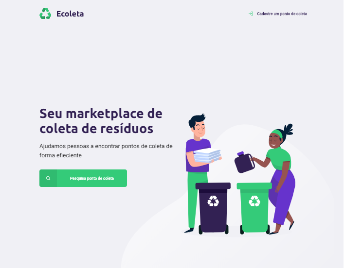

# Next Level Week - Ecoleta
<h3>Projeto sendo lecionado pela empresa Rocketseat<h3>

<h4>O objetivo do projeto está sendo desenvolver um sistema de busca de locais de coleta, aliando
  com a semana do meio ambiente a consciêntização do descarte em local correto.<h4>

<h4>As tecnologias utilizadas neste projeto até o momento, estão sendo:<h4>
  <ul>
      <li>HTML5</li>
      <li>Css3</li>
      <li>JavaScript</li>
 </ul>
  
<h4>Após o término do desenvolvimento do Front-end, iremos desenvolver o Back-end 
e funcionalidades da aplicação web em JavaScript. <h4>
  

<h1>Screenshot Página Inicial<h1>

 

